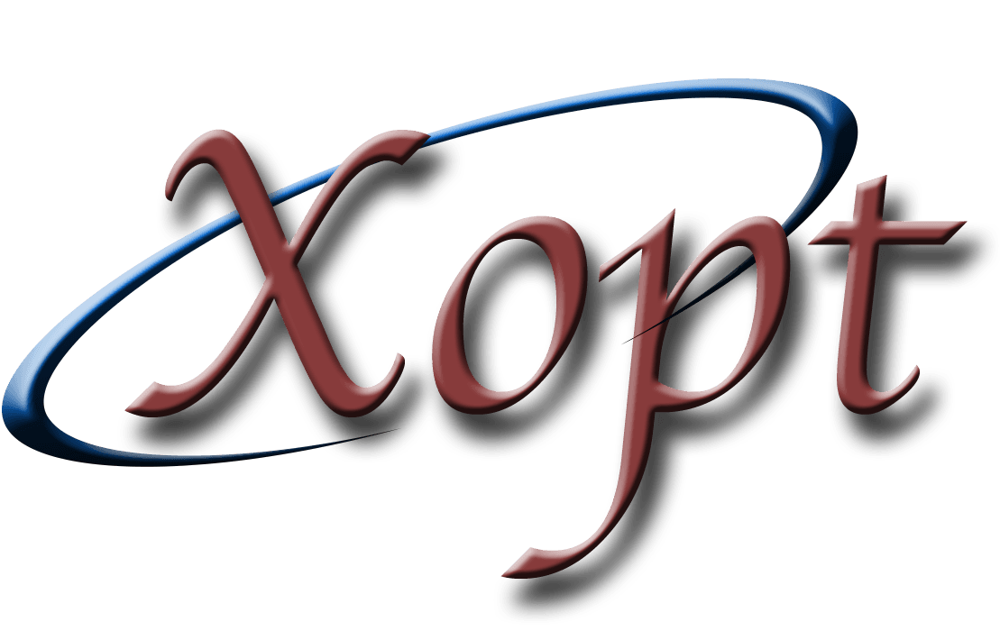

<div align="center">
  
</div>


Xopt
====


| **`Documentation`**                                                                                                              |
|----------------------------------------------------------------------------------------------------------------------------------|
| [](https://xopt-org.github.io/Xopt/index.html) |

| Name | Downloads | Version | Platforms |
| --- | --- | --- | --- |
| [](https://anaconda.org/conda-forge/xopt) | [](https://anaconda.org/conda-forge/xopt) | [](https://anaconda.org/conda-forge/xopt) | [](https://anaconda.org/conda-forge/xopt) |


Flexible optimization of arbitrary problems in Python.

The goal of this package is to provide advanced algorithmic support for arbitrary
optimization problems (simulations/control systems) with minimal required coding. Users
can easily connect
arbitrary evaluation functions to advanced algorithms with minimal coding with
support for multi-threaded or MPI-enabled execution.

Currenty **Xopt** provides:

- Optimization algorithms:
  - Genetic algorithms
    - `cnsga` Continuous NSGA-II with constraints
  - Bayesian optimization (BO) algorithms:
    - `upper_confidence_bound` BO using Upper Confidence Bound acquisition function
      (w/ or w/o constraints, serial or parallel)
    - `expected_improvement` BO using Expected Improvement acquisition function
      (w/ or w/o constraints, serial or parallel)
    - `mobo` Multi-objective BO (w/ or w/o constraints, serial or parallel)
    - `bayesian_exploration` Autonomous function characterization using Bayesian
      Exploration
    - `mggpo` Parallelized hybrid Multi-Generation Multi-Objective Bayesian
      optimization
    - `multi_fidelity` Multi-fidelity single or multi objective optimization
    - `BAX` Bayesian algorithm execution using virtual measurements
    - BO customization:
      - Trust region BO
      - Heteroskedastic noise specification
      - Multiple acquisition function optimization stratigies
  - `extremum_seeking` Extremum seeking time-dependent optimization
  - `rcds` Robust Conjugate Direction Search (RCDS)
  - `neldermead` Nelder-Mead Simplex
- Sampling algorithms:
  - `random` Uniform random sampling
- Convenient YAML/JSON based input format
- Driver programs:
  - `xopt.mpi.run` Parallel MPI execution using this input format

Xopt does **not** provide:
- your custom simulation or experimental measurement via an `evaluate` function.


Installing Xopt
===============

Installing `xopt` from the `conda-forge` channel can be achieved by adding `conda-forge` to your channels with:

```shell
conda config --add channels conda-forge
```

Once the `conda-forge` channel has been enabled, `xopt` can be installed with:

```shell
conda install xopt
```

It is possible to list all of the versions of `xopt` available on your platform with:

```shell
conda search xopt --channel conda-forge
```


Configuring an Xopt run
===============
Xopt runs can be specified via a YAML file or dictonary input. This requires `generator`, `evaluator`, and `vocs` to be specified, along with optional general options such as `max_evaluations`. An example to run a multi-objective optimiation of a user-defined function `my_function` is:
```yaml
generator:
    name: cnsga
    population_size: 64
    population_file: test.csv
    output_path: .

evaluator:
    function: my_function
    function_kwargs:
      my_arguments: 42

vocs:
    variables:
        x1: [0, 3.14159]
        x2: [0, 3.14159]
    objectives:
        y1: MINIMIZE
        y2: MINIMIZE
    constraints:
        c1: [GREATER_THAN, 0]
        c2: [LESS_THAN, 0.5]
    constants: {a: dummy_constant}

max_evaluations: 6400
```

Xopt can also be used through a simple Python interface.
```python
import math

from xopt.vocs import VOCS
from xopt.evaluator import Evaluator
from xopt.generators.bayesian import UpperConfidenceBoundGenerator
from xopt import Xopt

# define variables and function objectives
vocs = VOCS(
    variables={"x": [0, 2 * math.pi]},
    objectives={"f": "MINIMIZE"},
)

# define the function to optimize
def sin_function(input_dict):
    return {"f": math.sin(input_dict["x"])}

# create Xopt evaluator, generator, and Xopt objects
evaluator = Evaluator(function=sin_function)
generator = UpperConfidenceBoundGenerator(vocs=vocs)
X = Xopt(evaluator=evaluator, generator=generator, vocs=vocs)

# call X.random_evaluate() to generate + evaluate 3 initial points
X.random_evaluate(3)

# run optimization for 10 steps
for i in range(10):
    X.step()

# view collected data
print(X.data)
```

Defining an evaluation function
===============
Xopt can interface with arbitrary evaluate functions (defined in Python) with the
following form:
```python
def evaluate(inputs: dict) -> dict:
    """ your code here """
```
Evaluate functions must accept a dictionary object that **at least** has the keys
specified in `variables, constants` and returns a dictionary
containing **at least** the
keys contained in `objectives, constraints`. Extra dictionary keys are tracked and
used in the evaluate function but are not modified by xopt.

Using MPI
===============
Example MPI run, with `xopt.yaml` as the only user-defined file:
```b
mpirun -n 64 python -m mpi4py.futures -m xopt.mpi.run xopt.yaml
```


Citing Xopt
==========
If you use ```Xopt``` for your research, please consider adding the following
citation to your publications.
```
R. Roussel., et al., "Xopt: A simplified framework for optimization of accelerator problems using advanced algorithms",
in Proc. IPAC'23, Venezia.doi:https://doi.org/10.18429/JACoW-14th International Particle Accelerator Conference-THPL164
```

BibTex entry:
```bibtex
@inproceedings{Xopt,
	title        = {Xopt: A simplified framework for optimization of accelerator problems using advanced algorithms},
	author       = {R. Roussel and A. Edelen and A. Bartnik and C. Mayes},
	year         = 2023,
	month        = {05},
	booktitle    = {Proc. IPAC'23},
	publisher    = {JACoW Publishing, Geneva, Switzerland},
	series       = {IPAC'23 - 14th International Particle Accelerator Conference},
	number       = 14,
	pages        = {4796--4799},
	doi          = {doi:10.18429/jacow-ipac2023-thpl164},
	isbn         = {978-3-95450-231-8},
	issn         = {2673-5490},
	url          = {https://indico.jacow.org/event/41/contributions/2556},
	paper        = {THPL164},
	venue        = {Venezia},
	language     = {english}
}
```

Particular versions of Xopt can be cited from [Zenodo](https://zenodo.org/record/7983779)


Developers
==========

Clone this repository with a truncated git history (recommended):
```shell
git clone --depth=1 https://github.com/xopt-org/xopt.git
```

Or, clone this repository with the full git history (> 970 MB):
```shell
git clone https://github.com/xopt-org/xopt.git
```

Create an environment `xopt-dev` with all the dependencies:
```shell
conda env create -f environment.yml
```


Install as editable:
```shell
conda activate xopt-dev
pip install --no-dependencies -e .
```

Install pre-commit hooks:
```
pre-commit install
```

The pre-commit hooks perform autoformatting and report style-compliance errors.
* [ufmt](https://pypi.org/project/ufmt/) formats files w.r.t. [black](https://github.com/psf/black) a strict style enforcer, and [μsort](https://usort.readthedocs.io/en/stable/), which sorts imports in Python modules.
* [flake8](https://flake8.pycqa.org/en/latest/) confirms compliance. Occasionally black misses long-line comments/docstrings and they require manual format.

Pre-commit runs the hooks against your files. If the commit fails, correct the reported errors and then re-add the file with `git add my_file.py`.

### VSCode
The source control integration packaged with VSCode requires additional configuration. Git commands are run in the integrated terminal, which does not inherit the Python interpreter configured with the VSCode project thus breaking the pre-commit hooks. The integration terminal can be configured to use the conda Python environment by including a `.env` file in your project repository:

```
#!/usr/bin/bash
source /path/to/xopt-dev/bin/activate
```
